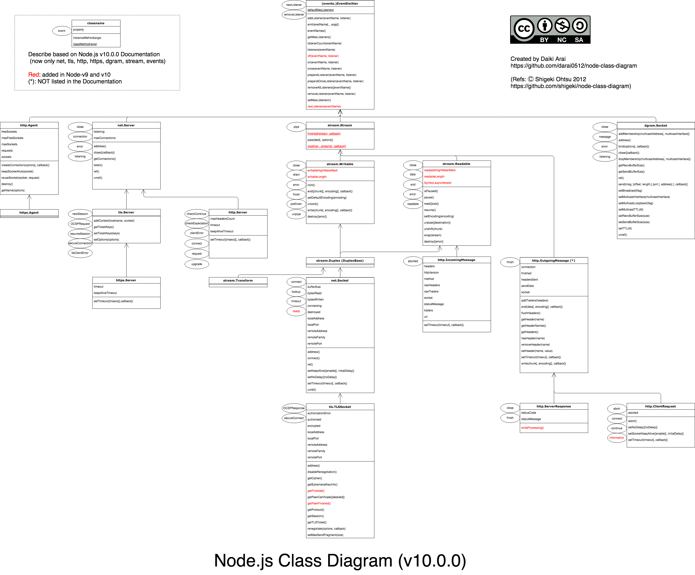

# node-class-diagram

Class Diagram of Node.js referring to [shigeki/node-class-diagram](https://github.com/shigeki/node-class-diagram)

Feedbacks are welcome.

You can download it by your favorite formats (such as svg, png with transparent background, ...) using [draw.io](https://www.draw.io/)

Note: https://about.draw.io/pricing/
> draw.io online is a free-to-license web application for everyone. It is completely free to use for any purpose, there is no premium pay-for functionality, watermarking, or other limitations. You own the content you produce with draw.io and may use it for any purpose, including commercially. We don’t sell your personal information or data. We don’t store your data. You own your data and the application is open source.
